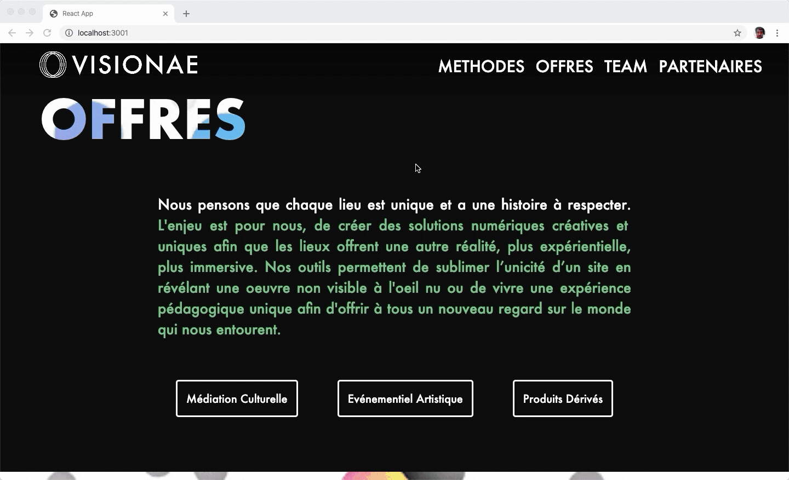

# VISIONAE LANDING PAGE

Personnal project for the startup Visionae, a creative agency that makes AR experiences.

This single-page website was made in React.

## SUMMARY
- Features
- Usage
- Gallery

## Features:
- A user interface that arouses user's interest
- Motion design (logo and background animation) made with After Effects.
- Scroll behaviors (for navigation + animation)

## Usage
In main folder, run: 

```
npm install
npm start
```

__NB:__ if you haven't install node on your computer, run: `brew install node`

## Gallery

### Main animation


### Sitemap & scroll behaviors


### Multiselect menu


